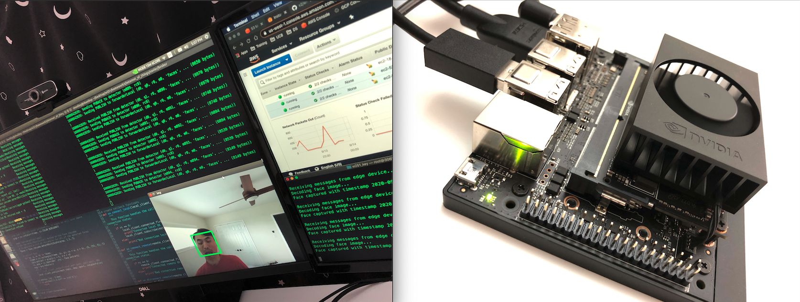
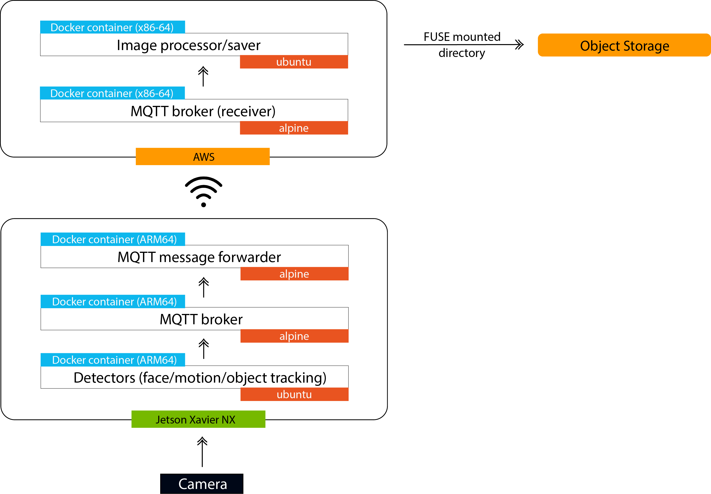

## Internet of Things 101
The objective of this playground project is to build a lightweight IoT application pipeline with components running both on the edge (Nvidia Jetson Xavier NX) and the cloud (AWS). To demonstrate the pipeline, a face detector, a motion detector are used on the edge device. The face detector captures faces from a live video stream in real time, transmit to the cloud in real time via mqtt, and save the captured faces in the cloud for long term storage. The motion detector does the same thing to detected objects in motion. The object tracker tracks a pre-defined object.

- [detector - face](https://github.com/chenliny/IoT/blob/master/IoT_101/xavier/detector/detector.py)  

- [detector - motion](https://github.com/chenliny/IoT/blob/master/IoT_101/xavier/detector/detector_motion_v2.py)  

- [detector - object tracking](https://github.com/chenliny/IoT/blob/master/IoT_101/xavier/detector/detector_tracking.py)  

#### Pipeline components
- **Docker** is used to package all components as portable microservices.
- On the edge device, **Alpine Linux** is used as the base OS for the containers as it is frugal in terms of storage.
- For the edge face and motion detector component, **OpenCV** is used to scan the video frames coming from the connected USB camera for faces/objects. When one or more faces/objects in motion are detected in the frame, the application would cut them out of the frame and send via a binary message to the cloud.
- **MQTT** is used as the messaging fabric. Therefore, an MQTT client is used to send and receive messages, and an MQTT broker is used as the server component of this architecture. Nvidia Jetson NX is used as an IoT Hub. Therefore, a local MQTT broker is installed in the NX, and the face detector sends its messages to this broker first. Then, another component is developed to receive these messages from the local broker, and forwards them to the cloud.
- On the cloud, a **lightweight virtual machine** is provisioned and runs an MQTT broker; the faces/objects are published here as binary messages. Another component is created on the cloud to receive these binary files, decode them, and save them into object storage.

#### Pipeline architecture

[On the edge device (Nvidia Xavier NX)](https://github.com/chenliny/IoT/tree/master/IoT_101/xavier):
- MQTT mosquitto broker container (Alpine Linux based): This container acts as the broker on the edge device. Whenever the broker receives messages, it will place those messages into topics. Subscribers will then be able to obtain the messages from corresponding topics.
- Detector container: This container connects to the USB camera. It detects faces/objects and sends them to the internal mosquitto broker.
- MQTT forwarder container (Alpine Linux based): This container subscribes to the topics from the internal broker, fetches face/object files, and publishes them to the cloud mosquitto broker.

[On the cloud (AWS)](https://github.com/chenliny/IoT/tree/master/IoT_101/aws):
- MQTT mosquitto broker container (Alpine Linux based): This container acts as the broker on the cloud. Whenever the broker receives messages, it will place those messages into topics. Subscribers will then be able to obtain the messages from corresponding topics.
- saver container: This container connects to the cloud mosquitto broker and acts as the image processor. It receives face/object messages, and places them into the object storage on the cloud.
